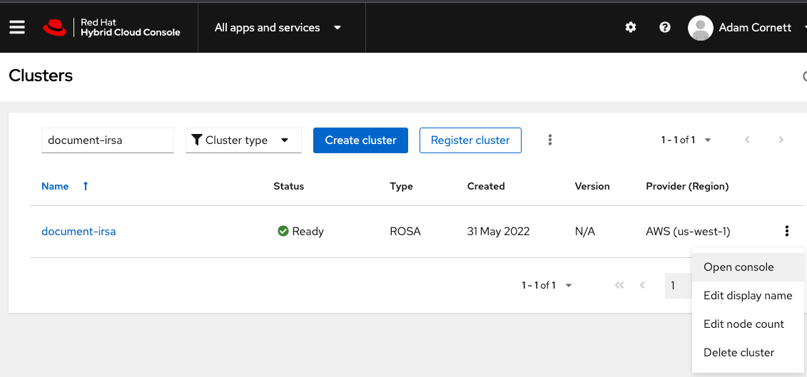
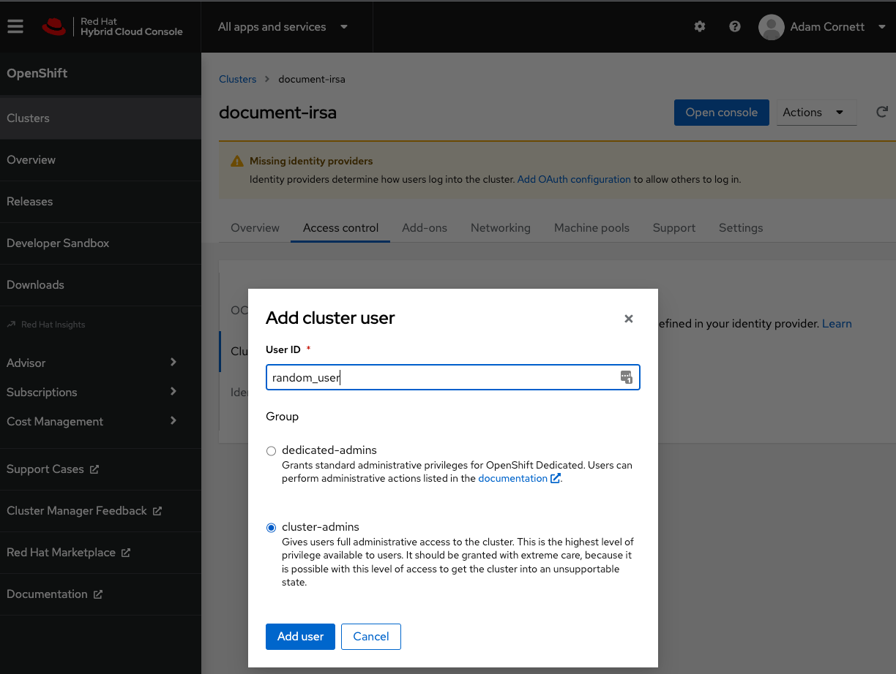
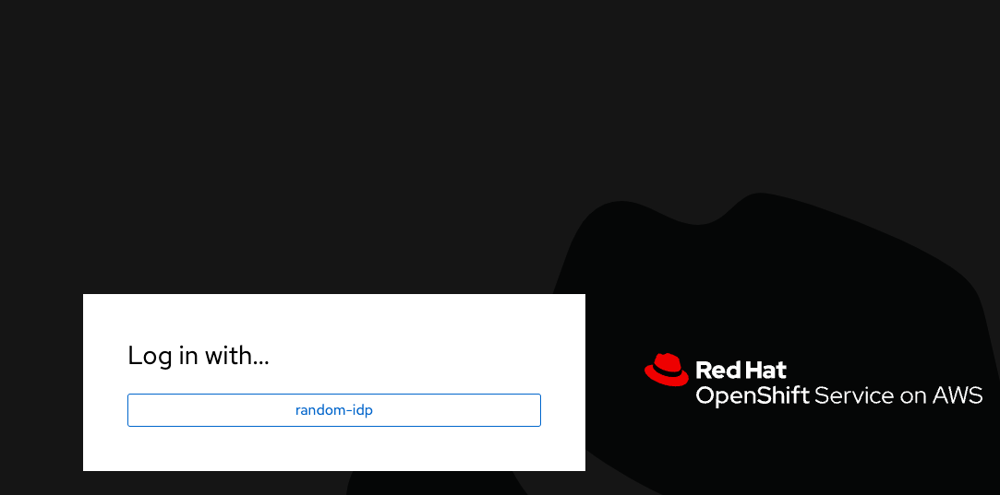

## Step-By-Step Guide to Get the ACK S3 Operator working with IRSA on a new ROSA Cluster
In order to use [IAM Roles for Service Accounts](https://docs.aws.amazon.com/eks/latest/userguide/iam-roles-for-service-accounts.html) or IRSA 
there is a requirement that the OpenShift cluster has already been provisioned to use the [AWS Security Token Service](https://docs.aws.amazon.com/STS/latest/APIReference/welcome.html) (STS).
This doc will show how to spin up a ROSA cluster using STS to keep things simple and repeatable. All the below steps were run on a vagrant VM
running Fedora 35, which is also included the only modification to that Vagrantfile would be to put the path to your AWS credentials file, or the prerequisites can be followed on the system of your choosing.

### Prerequisites
1. Red Hat account
2. AWS account
3. `oc cli` can be obtained [here](https://docs.openshift.com/container-platform/4.10/cli_reference/openshift_cli/getting-started-cli.html)
4. `rosa cli` can be obtained [here](https://console.redhat.com/openshift/downloads)
5. `ccoctl` steps to obtain and install [here](https://docs.openshift.com/container-platform/4.10/installing/installing_alibaba/manually-creating-alibaba-ram.html#cco-ccoctl-configuring_manually-creating-alibaba-ram) **Note:** This tool only works on linux.
6. `aws cli` can be obtained [here](https://docs.aws.amazon.com/cli/latest/userguide/getting-started-install.html)

### Create a ROSA Cluster
We will create a cluster with default options, however more detailed instructions can be found [here](https://cloud.redhat.com/learn/how-create-cluster-red-hat-openshift-service-aws-sts/creating-cluster-using-red-hat-openshift)

1. First, create the required account-wide roles and policies, including the Operator policies, with `$ rosa create account-roles --prefix <prefix> --mode auto --region us-west-1 -y`
   1. Note: When using auto mode, you can optionally specify the -y argument to bypass the interactive prompts and automatically confirm operations
   2. `--prefix` is important since one ARN can have multiple account roles, ie one per cluster. Without this, existing ones would be overwritten
2. Next, you can create a cluster with STS using the defaults. When you use the defaults, the latest stable OpenShift version is installed: `$ rosa create cluster --cluster-name <cluster-name> --sts --mode auto --region us-west-1 -y`
3. Check the status of your cluster: `$ rosa describe cluster --cluster <cluster_name|cluster_id>`
   1. Our you can follow the installation logs: `$ rosa logs install -c <cluster-name> --region us-west-1 --watch`
4. After the cluster is provisioned successful go to `https://console.redhat.com/openshift` and search for the cluster
   1. 
5. Create a random user and give it cluster admin access
   1. Run this CMD `$ rosa create idp --cluster <cluster-name> --region us-west-1 --username random_user --password randomPa55W0rd! --type htpasswd --name random-idp`
      1. In the prompt type `random-idp`
      2. The output will be something like below:
      ```shell
        rosa create idp --cluster <cluster-name> --region us-west-1 --username random_user --password randomPa55W0rd! --type htpasswd --name random-idp
        ? Identity provider name: random-idp
        I: Configuring IDP for cluster '<cluster-name>'
        I: Identity Provider 'random-idp' has been created.
        It will take up to 1 minute for this configuration to be enabled.
        To add cluster administrators, see 'rosa grant user --help'.
        To login into the console, open https://console-openshift-console.apps.<cluster-name>.66ip.p1.openshiftapps.com and click on random-idp.
      ```
      3. Go to the `Access Controls` to grant the above user cluster admin
         1. 
      4. Log into the cluster with the above user
         1. Click `random-idp` 
         2. Enter the ID/PW created above

### Creating the IAM Role for the S3 Operator
1. Create a new directory for credential request yaml `$ mkdir credrequests && cd $_` 
2. Create a new file `$ touch ack-irsa-role.yaml`
   - Edit the file with the below content
    ```yaml
    apiVersion: cloudcredential.openshift.io/v1
    kind: CredentialsRequest
    metadata:
      labels:
        controller-tools.k8s.io: "1.0"
      name: ack-s3-controller-iam-ro-creds
      namespace: ack-system
    spec:
      providerSpec:
        apiVersion: cloudcredential.openshift.io/v1
        kind: AWSProviderSpec
        statementEntries:
        - action:
          - s3:Get*
          - s3:Put*
          effect: Allow
          resource: '*'
      secretRef:
        name: ack-s3-controller-iam-ro-creds
        namespace: ack-system
      serviceAccountNames:
      - ack-s3-controller
    ```
3. Find the Identity Provider that was created for the cluster
   1. The Identity Provider will be in the `serviceAccountIssuer` field in the `cluster` `Authentication` resource
      - Input: `$ oc get authentication cluster -oyaml`
      - Output: 
        ```yaml
        apiVersion: config.openshift.io/v1
        kind: Authentication
        metadata:
          name: cluster
        spec:
          serviceAccountIssuer: https://<OIDC_IDENTITY_PROVIDER_S3_BUCKET>
        ```
4. Get the Open ID Connect Providers full ARN
   - Input: `$ aws iam list-open-id-connect-providers | grep <OIDC_IDENTITY_PROVIDER_S3_BUCKET>`
   - Output:
    ```json
     {
    "OpenIDConnectProviderList": [
        {
            "Arn": "<OIDC_IDENTITY_PROVIDER_ARN>"
        }
    ]
    }
    ```
5. Create the IAM Role with the ARN found above
   - Input:
    ```shell
      ccoctl aws create-iam-roles \
      --name=ack-iras-role \
      --region=us-west-1 \
      --credentials-requests-dir=credrequests  \
      --identity-provider-arn=<OIDC_IDENTITY_PROVIDER_ARN>  \
      --output-dir=outputs
    ```
6. Get the ARN for the IAM role created above
    - Input: `$ cat outputs/manifests/ack-system-ack-s3-controller-iam-ro-creds-credentials.yaml`
    - Output:
      ```yaml
      apiVersion: v1
      stringData:
        credentials: |-
          [default]
          role_arn = arn:aws:iam::123456789000:role/ack-iras-role-ack-system-ack-s3-controller-iam-ro-creds
          web_identity_token_file = /var/run/secrets/openshift/serviceaccount/token
      kind: Secret
      metadata:
        name: ack-s3-controller-iam-ro-creds
        namespace: ack-system
      ```
7. Apply the `AmazonS3FullAccess`Access Policy to the Role since the Operator targets S3
   - ```shell
     aws iam attach-role-policy \
     --role-name ack-iras-role-ack-system-ack-s3-controller-iam-ro-creds \
     --policy-arn 'arn:aws:iam::aws:policy/AmazonS3FullAccess'
     # no output from this command
     ```
   - Verify that the policy was added
     - Input:
       ```shell
       aws iam list-attached-role-policies \
       --role-name ack-iras-role-ack-system-ack-s3-controller-iam-ro-creds
       ```
     - Output:
       ```json
       {
          "AttachedPolicies": [
              {
                 "PolicyName": "AmazonS3FullAccess",
                 "PolicyArn": "arn:aws:iam::aws:policy/AmazonS3FullAccess"
              }
       ]
       }
       ```

### Setup and Installing the ACK S3 Operator
1. The S3 Operator in OperatorHub does not have changes that support IRSA. The only way to provide AWS credentials to an 
ACK Operator is via a `Secret` containing an `AWS_ACCESS_KEY_ID` and `AWS_SECRET_ACCESS_KEY`, this means we have to apply custom catalog to support IRSA for this
operator until the changes make it upstream.
   1. Add the catalog to the cluster
```yaml
oc apply -f - <<'EOF'
apiVersion: operators.coreos.com/v1alpha1
kind: CatalogSource
metadata:
  name: s3-controller
  namespace: openshift-marketplace
spec:
  displayName: S3 ACK Controller
  icon:
    base64data: ""
    mediatype: ""
  image: quay.io/acornett/s3-index:v0.1.0
  priority: -200
  publisher: Amazon
  sourceType: grpc
  updateStrategy:
    registryPoll:
      interval: 10m0s
EOF
```
2 Create a new namespace and a ConfigMap for the controller to be installed in
   1. Create a new project: `oc new-project ack-system`
   2. Create a config map that with the required values for the controller to start properly
```yaml
oc apply -f - <<'EOF'
apiVersion: v1
kind: ConfigMap
metadata:
  name: ack-user-config
data:
  ACK_ENABLE_DEVELOPMENT_LOGGING: "true"
  ACK_LOG_LEVEL: debug
  AWS_REGION: us-west-2
  ACK_WATCH_NAMESPACE: ""
  AWS_ENDPOINT_URL: ""
  ACK_RESOURCE_TAGS: "hellofromocp"
EOF  
```
3. Install the operator via the embedded OperatorHub
   1. Make sure to select `Manual Mode` so changes to the Service Account do not get overwritten but an operator update
   2. Note: The installation will not complete since we haven't given the controller any AWS credentials to use yet
   3. Check the current state of the deployment
      - Input: `$ oc describe deployment ack-s3-controller -n ack-system`
      - Output:
        ```yaml
        Environment Variables from:
        ack-user-config   ConfigMap  Optional: false
        ack-user-secrets  Secret     Optional: true
        Environment:
        ACK_SYSTEM_NAMESPACE:      (v1:metadata.namespace)
        OPERATOR_CONDITION_NAME:  ack-s3-controller.v0.1.0
        Mounts:                     <none>
        ```
4. Associate an IAM role to the controllers service account
   1. Annotate the ServiceAccount `oc annotate sa ack-s3-controller eks.amazonaws.com/role-arn='arn:aws:iam::123456789000:role/ack-iras-role-ack-system-ack-s3-controller-iam-ro-creds' -n ack-system`
      - Optional values that can be annotated, but not necessary for our example
      - ```yaml
        # optional: Defaults to "sts.amazonaws.com" if not set
        eks.amazonaws.com/audience: "sts.amazonaws.com"
        # optional: When set to "true", adds AWS_STS_REGIONAL_ENDPOINTS env var
        #   to containers
        eks.amazonaws.com/sts-regional-endpoints: "true"
        # optional: Defaults to 86400 for expirationSeconds if not set
        eks.amazonaws.com/token-expiration: "86400"
        ```    
5. Restart the operator's deployment so the changes to the controllers service account get picked up. This is where all the magic happens, the 
[aws-pod-identity-webhook](https://github.com/openshift/aws-pod-identity-webhook) makes use of a [MutatingWebhookConfiguration](https://kubernetes.io/docs/reference/access-authn-authz/admission-controllers/#mutatingadmissionwebhook)
to modify the configuration of the pods at runtime.
   - Restart Deployment: `$ oc rollout restart deployment ack-s3-controller -n ack-system`
   - Check that the Pod's state is `Running`: `$ oc get pods -w -n ack-system`
   - Wait till the pod becomes running
   - Input: `$ oc describe pod <POD_NAME> -n ack-system`
   - Output: Notice the new Environment variables `AWS_ROLE_ARN` and `AWS_WEB_IDENTITY_TOKEN_FILE` that are not part of the deployment?
     ```yaml
      Environment:
        ACK_SYSTEM_NAMESPACE:         ack-system (v1:metadata.namespace)
        OPERATOR_CONDITION_NAME:      ack-s3-controller.v0.1.0
        AWS_ROLE_ARN:                 arn:aws:iam::123456789000:role/ack-iras-role-ack-system-ack-s3-controller-iam-ro-creds
        AWS_WEB_IDENTITY_TOKEN_FILE:  /var/run/secrets/eks.amazonaws.com/serviceaccount/token
      Mounts:
        /var/run/secrets/eks.amazonaws.com/serviceaccount from aws-iam-token (ro)
     ```

## Validate the Operators Functionality
For this we will create an S3 Bucket with the operator and make sure that it appears in AWS.
1. Create a Bucket
```yaml
oc apply -f - <<'EOF'
apiVersion: s3.services.k8s.aws/v1alpha1
kind: Bucket
metadata:
  name: random-bucket-86754332
  namespace: ack-system
spec:
  name: random-bucket-86754332
EOF
```
2. Validate it was created
   - Input: `aws s3 ls | grep random-bucket-86754332`
   - Output: `2022-06-02 21:18:21 random-bucket-86754332`
   
## Conclusion
At this point we have done the following
- Provisioned a ROSA cluster that utilizes STS
- Created an IAM Role for our Operators Service account to use
- Deployed our Operator
- Create a `Custom Resource` that our Operator owns ie a `Bucket`